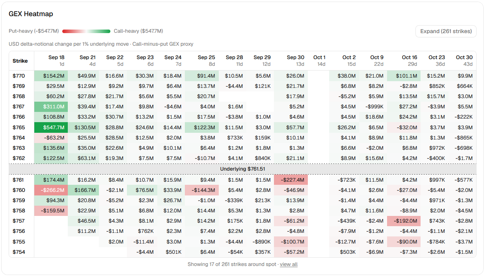

#  GEX Lens

[](https://github.com/zhuy9/GEX-lens/actions/workflows/ci.yml)

A local, single-user dashboard for options gamma exposure (GEX) and implied
volatility (IV). Each manual refresh fetches one option-chain snapshot, prices
it, saves it, and renders:

- a strike-by-expiration GEX heatmap (call-minus-put proxy or gross, per 1% or
  per $1 move), and
- a 3D IV surface with the observed points on top.

Pricing uses a cash-dividend present-value Black-Scholes-Merton approximation
(`cash_pv_bsm_v2`) with a SOFR-based rate and a reviewed dividend schedule. See
[ADR-0001](docs/ADR-0001-pricing-inputs-dividends-and-gex-units.md).

This is a personal research tool, not a trading system.



## Status

- PRD milestones M0-M5 are done:
  [docs/m5-validation.md](docs/m5-validation.md).
- ADR-0001 milestones M0-M6 are done:
  [docs/adr-0001-validation.md](docs/adr-0001-validation.md).

## Stack

- Frontend: React, TypeScript, Vite, shadcn/ui, Tailwind CSS v4, Plotly.js
- Backend: Python 3.12, FastAPI, Uvicorn, Pydantic, httpx, SciPy
- Storage: DuckDB (one embedded file, no server)
- Tests: pytest, Vitest, React Testing Library

## Quick start (fixture mode)

Fixture mode uses synthetic data and makes no network calls. You need
Python 3.12 and Node.js 22.12+.

Commands are Windows PowerShell. On macOS/Linux use `python3.12`,
`.venv/bin/activate`, and `cp`.

Backend (run from `backend/`, because relative paths in `settings.json` resolve
from there):

```powershell
cd backend
py -3.12 -m venv .venv
.venv\Scripts\Activate.ps1
pip install -r requirements.txt
Copy-Item settings.example.json settings.json   # git-ignored; never commit it
python app.py
```

The API serves on `http://127.0.0.1:8000`.

Frontend (in a second terminal, with the backend running):

```powershell
cd frontend
npm ci
npm run dev
```

Open `http://127.0.0.1:5173`. The dev server proxies `/api` to the backend.
Click **Refresh** to create the first snapshot.

## Settings reference (`backend/settings.json`)

`settings.json` is strict JSON: no comments, no extra keys. The backend
checks every key at startup and refuses to start on a bad value.

There is no symbol list here. Every instrument in
[backend/instruments.py](backend/instruments.py) is enabled (`SPY`, `QQQ`,
`AAPL`), in that order, and the first one is the default.

| Key | Accepted values | Notes |
|---|---|---|
| `source_mode` | `"fixture"`, `"nasdaq"` | Option-chain source. `"nasdaq"` is unofficial; read [Data sources](#data-sources-and-usage-rights) first. |
| `db_path` | File path | DuckDB file. The folder is created if missing. |
| `refresh_min_interval_seconds` | Integer, at least `60` | One cooldown shared by all symbols. Failed refreshes also start it, and an upstream rate limit can extend it. |
| `pricing_model` | `"cash_pv_bsm_v2"` | The only model. Shown in the UI and API. |
| `rate_source` | `"fixture"`, `"nyfed_sofr"`, `"manual"` | `"manual"` reads `manual_rate` from the reference-inputs file. |
| `dividend_sources` | Object with exactly one key per instrument: `SPY`, `QQQ`, `AAPL` | A missing or extra key stops startup. |
| `dividend_sources.<SYMBOL>` | `"fixture"`, `"manual_schedule"`, `"nasdaq_dividends"` | `"nasdaq_dividends"` works for `QQQ` and `AAPL` only. Nasdaq has no dividend data for `SPY`, so use `"manual_schedule"`. |
| `reference_inputs_path` | File path | Your local reference-inputs file (git-ignored). Needed when `rate_source` is `"manual"` or any dividend source is not `"fixture"`. |

Rules for combining values:

- Use `"fixture"` for the rate and dividend sources only with
  `source_mode: "fixture"`. Fixture reference data is synthetic and dated to a
  fixed fixture clock.
- Every non-fixture dividend source, including `"nasdaq_dividends"`, still
  needs a reviewed schedule for that symbol in the reference-inputs file.
- The old `risk_free_rate`, `dividend_yields`, and `symbols` keys are rejected
  with a migration message.

A live config looks like this:

```json
{
  "source_mode": "nasdaq",
  "db_path": "data/options.duckdb",
  "refresh_min_interval_seconds": 60,
  "pricing_model": "cash_pv_bsm_v2",
  "rate_source": "nyfed_sofr",
  "dividend_sources": {"QQQ": "nasdaq_dividends", "AAPL": "nasdaq_dividends", "SPY": "manual_schedule"},
  "reference_inputs_path": "reference_inputs.json"
}
```

## Reference inputs (`backend/reference_inputs.json`)

This is your own dividend review and, optionally, a manual rate. It is
git-ignored. The backend reads it once at the start of each refresh; a
malformed file fails that refresh.

All values below are synthetic:

```json
{
  "input_schema_version": 1,
  "manual_rate": {
    "rate_cc": 0.04,
    "effective_date": "2026-01-02",
    "entered_at": "2026-01-02T21:00:00Z",
    "source_ref": "synthetic-example",
    "reason": "example only"
  },
  "schedules": {
    "SPY": {
      "symbol": "SPY",
      "reviewed_at": "2026-01-02T21:00:00Z",
      "coverage_start": "2026-01-02",
      "coverage_end": "2026-04-02",
      "no_other_events_expected": true,
      "source_refs": ["synthetic-example"],
      "expected_events": [
        {
          "event_id": "spy-2026q1",
          "ex_date": "2026-01-07",
          "payment_date": "2026-02-11",
          "amount": "1.25",
          "amount_status": "estimated",
          "source_ref": "synthetic-example"
        }
      ]
    }
  }
}
```

- `manual_rate`: required when `rate_source` is `"manual"`; otherwise it can be
  `null`.
  - `rate_cc` is a continuously compounded ACT/365F rate between `-0.10` and
    `0.50`. It is not a percentage.
  - `effective_date` must be at most 7 days before the valuation date.
  - Timestamps must include a timezone.
- `schedules.<SYMBOL>`: one entry per symbol that uses a non-fixture dividend
  source.
  - `reviewed_at` must be 0-7 days old (New York dates) when you refresh.
  - `coverage_start` must be on or before the valuation date.
  - `coverage_end` must be on or after the latest in-scope expiration (about
    60 days out).
  - `no_other_events_expected` must be `true`.
  - An empty `expected_events` list means "no dividends expected in this
    window".
- `expected_events[].amount_status`: `"declared"` or `"estimated"` (both need
  `amount` as a decimal string), or `"pending_source"` (`amount: null`, only
  with `"nasdaq_dividends"`).
  - With `"nasdaq_dividends"`, a source ex-date inside your coverage window that
    is missing from `expected_events` fails the refresh. Review it and add it.
  - `payment_date` may be `null`. Discounting then assumes the ex-date, with a
    warning.

For the full rules, see ADR-0001 Sections 5.2 and 7.

## Using the dashboard

- **Refresh** is the only action that fetches data. Nothing polls or
  auto-refreshes.
- **Refresh including reference inputs** (in the Pricing inputs panel) skips
  the cached SOFR and dividend data. The rate cache lasts 1 hour and the
  dividend cache 6 hours.
- The backend keeps the latest 20 snapshots per source mode and symbol.
- Warnings (assumed multiplier, estimated dividends, near ex-date, and so on)
  appear on the Snapshot card and as a badge on each chart.

API (all under `http://127.0.0.1:8000`):

| Method | Path | Purpose |
|---|---|---|
| GET | `/api/health` | Database reachable |
| GET | `/api/config` | Symbols, scope, cooldown state |
| GET | `/api/dashboard/{symbol}` | Latest saved snapshot (no provider calls) |
| POST | `/api/dashboard/{symbol}/refresh` | Fetch, price, save. Add `?force_reference_refresh=true` to bypass reference caches. |

## Checks

These match CI:

```powershell
cd backend
ruff check .
ty check app.py provider.py nasdaq.py fixtures.py analytics.py storage.py models.py market_inputs.py rates.py instruments.py api.py reconcile.py
pytest --ignore=tests/test_performance.py
cd ..\frontend
npm run lint
npm run build
npm test
```

`tests/test_performance.py` checks timing budgets. Its results depend on the
machine, so CI skips it. Run `pytest` with no flags to include it.

## Offline reconciliation

`backend/reconcile.py` is a read-only diagnostic. It reruns one saved snapshot
under a scenario rate and dividend schedule and compares the result with what
was saved. It is not a backtester, and it never fetches data.

Stop the backend first: the script opens the same DuckDB file.

```powershell
cd backend
python reconcile.py --db data/options.duckdb `
  --snapshot-id <uuid> `
  --scenario-inputs reference_inputs.scenario.json `
  --out exports/<uuid>-pricing-comparison
```

- `--scenario-inputs` uses the reference-inputs format above and must include
  `manual_rate` and a schedule for the snapshot's symbol.
- It writes `summary.md`, `contracts.csv`, `cells.csv`, and `inputs.json`. It
  will not overwrite a folder that already has a report.
- It exits non-zero with `BASELINE_REPRODUCTION_FAILED` if it cannot first
  reproduce the snapshot's own saved values. That points to a bug, not a
  rate or dividend effect.

## Adding a data source

- Chain, rate, and dividend adapters implement the `OptionsDataProvider`,
  `RateDataProvider`, and `DividendDataProvider` Protocols in
  [backend/provider.py](backend/provider.py).
- Register a new adapter with one branch in the matching `build_*` factory in
  [backend/app.py](backend/app.py). Analytics, storage, and the frontend do not
  change.
- To add a symbol, verify its sources first (see the source-contract docs), then
  add an entry to [backend/instruments.py](backend/instruments.py) and a
  `dividend_sources` entry to `settings.json`.
- The underlying price must come from the option-chain response itself, never
  from a separate quote endpoint.
- [backend/tests/test_provider_boundary.py](backend/tests/test_provider_boundary.py)
  lists the boundary tests a provider must pass.

## Documentation

- [Product requirements](docs/options_analytics_mvp_prd.md)
- [ADR-0001: pricing inputs, dividends, and GEX units](docs/ADR-0001-pricing-inputs-dividends-and-gex-units.md)
- Data-source contracts:
  - [Nasdaq option chain](docs/source-contract.md)
  - [Nasdaq dividends](docs/dividend-source-contract.md)
  - [NY Fed SOFR](docs/rate-source-contract.md)

Current build/test status is reported by GitHub Actions.

## Data sources and usage rights

- **Nasdaq** (option chain; dividends for QQQ and AAPL): unofficial website
  endpoints. This project is not affiliated with or endorsed by Nasdaq. Nothing
  here grants a data license. Review [Nasdaq's terms](https://www.nasdaq.com/legal)
  yourself before using `"nasdaq"` or `"nasdaq_dividends"`.
- **New York Fed SOFR** (`"nyfed_sofr"`): the public rates API.
- Fixtures, tests, and screenshots use synthetic data only. Never commit
  captured market-data responses, databases, credentials, or exports.

## Research limitations

- This tool works from snapshots. It is not a real-time feed, and its output is
  not investment advice or a trading signal.
- The model is a European BSM approximation applied to American-style options.
  It does not model early exercise.
- OI does not identify dealer positions.
- SOFR is used as a flat overnight proxy, not a term curve.
- The Nasdaq chain has no per-quote timestamps, no multiplier field, and only
  date-level spot timing. See [docs/source-contract.md](docs/source-contract.md).
- Fixture mode never substitutes for live verification.

## License

[MIT](LICENSE) for original project code. Third-party components and market
data keep their own licenses; this license grants no rights to either.
